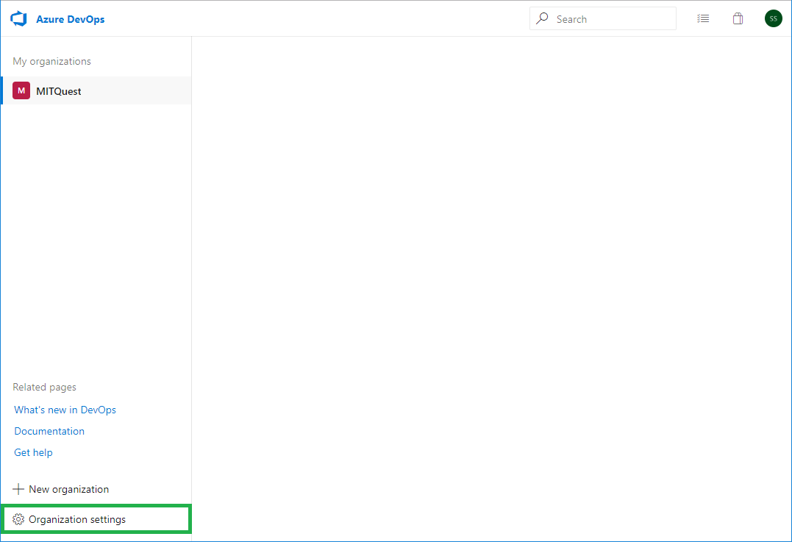
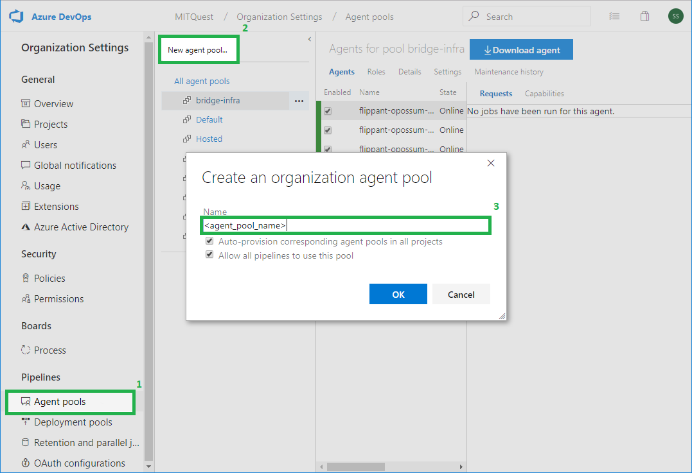

# bridger
Bridger is an agent designed to be run in Azure Pipelines Build and Release workflows enabling
the development of _Cross Cloud_ CI/CD pipelines. Built on top of Microsoft's provided Azure
Pipelines Agent, Bridger integrates natively with Azure and provides the additional authentication
mechanisms needed to integrate with other public cloud providers.

## Prerequisites
Bridger is an application deployed to [Kubernetes](http://kubernetes.io) using [Helm](https://helm.sh).
As such, users should have an understanding of how Helm packages and installs software on Kubernetes,
have access to a Kubernetes cluster and have a general understanding of Docker and Kubernetes. Since
Bridger integrates directly with Azure Pipelines, users are expected to have a basic
understanding of Azure Pipelines and have an account in Azure DevOps. Specifically, users should understand
[Build and Release](https://docs.microsoft.com/en-us/azure/devops/pipelines/agents/agents)
concepts, and [Agent Pools](https://docs.microsoft.com/en-us/azure/devops/pipelines/agents/pools-queues).
Users are also required to have permissions to administer Agent Pools in their associated Azure DevOps
Subscription.

## Getting Started
In order to deploy Bridger, a user in Azure DevOps should create a Personal Access Token (PAT)
from within their Azure DevOps account. This user will need to have the permissions to manage
Agent Pools within the Project.

### Creating an Agent Pool in Azure DevOps
1. From Your Azure DevOps organization page, go to Organization Settings  

1. Select Agent Pools
1. New agent pool...
1. Provide a name for the new pool in place of `<agent-pool-name>`  

### Registering Agents
In order for Bridger to register as an agent in the newly created Agent Pool in Azure DevOps, you will
have to provide the agents with with a minimum of `Agent Pool (Read & manage)` permission levels. To do
thiso generate a PAT by following the directions
[here](https://docs.microsoft.com/en-us/azure/devops/organizations/accounts/use-personal-access-tokens-to-authenticate?view=azure-devops#create-personal-access-tokens-to-authenticate-access)
and select the correct permissions.
